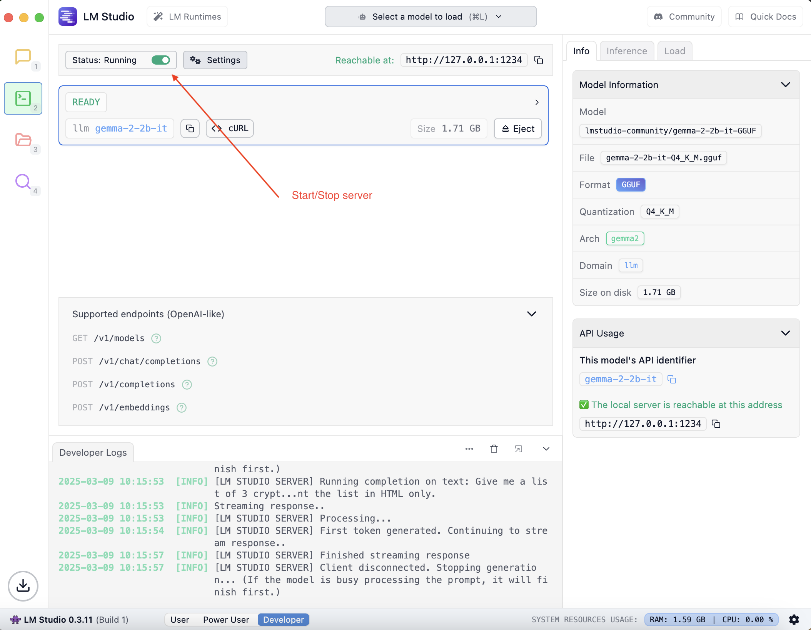

# LM Studio

LM Studio is a desktop application to enable users to run LLMs locally.

## Contents

## Installation and Setup

### macOS

* Homebrew `brew install -cask lm-studio`
* Download application from [LM Studio](https://lmstudio.ai/)

## LM Studio Operations

1. Start/Stop model server

## Interactring with the AI Model

This is the REST API to interact with AI models

* [Version 1](https://lmstudio.ai/docs/app/api/endpoints/openai)

## Working Examples

