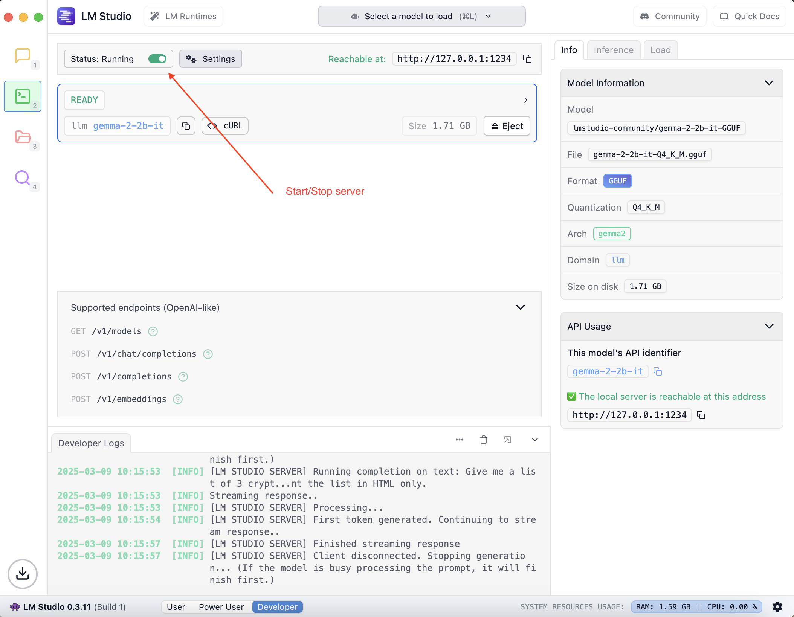

# LM Studio

LM Studio is a desktop application to enable users to run LLMs locally.

## Contents

## Installation and Setup

### macOS

* Homebrew `brew install -cask lm-studio`
* Download application from [LM Studio](https://lmstudio.ai/)

## LM Studio Operations

1. Start/Stop model server

## Interactring with the AI Model

This is the REST API to interact with AI models

* [Version 1](https://lmstudio.ai/docs/app/api/endpoints/openai)

## Working Examples

Examples demonstrating interactions with LM Studio

### Using Golang

* Example 1
    * Get a list of models.
    * Using OpenAI compatible endpoint `v1/models`.
    * [Source](./go/ex1/main.go).
* Example 2
    * Prompting LLM to list cryptocurrencies
    * Using OpenAI compatible endpoint `/v1/completion` with no streaming
    * [Source](./go/ex2/main.go)
* Example 3
    * Prompting LLM to list cryptocurrencies
    * Using the OpenAPI compatible `/v1/completion` with streaming
    * [Source](./go/ex3/main.go)